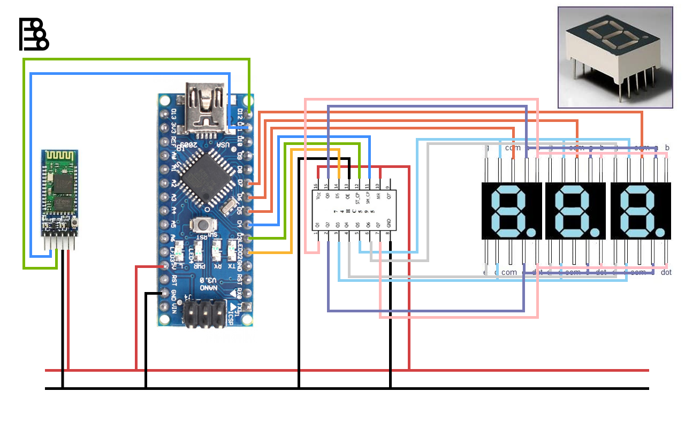

# Arduino LED Display with Bluetooth Input

This Arduino sketch enables an LED display to showcase scrolling text received via Bluetooth using an HC-05 module. The sketch utilizes a shift register to control the LED segments for each character and incorporates SoftwareSerial to communicate with the Bluetooth module.

## Hardware Setup

- Connect the HC-05 Bluetooth module to the Arduino using SoftwareSerial on pins 12 (RX) and 11 (TX).
- Connect the LED display using a shift register with latch, data, and clock pins connected to pins 3, 2, and 4, respectively.
- Use common pins for three displays connected to pins 5, 6, and 7.

## Libraries Used

- Arduino.h: Standard Arduino library for basic functionality.
- SoftwareSerial.h: Enables serial communication with the HC-05 module.

## Pin Configuration

- `latchPin`: Pin connected to the latch pin of the shift register.
- `dataPin`: Pin connected to the data pin of the shift register.
- `clockPin`: Pin connected to the clock pin of the shift register.
- `digitsPins[]`: Array containing common pins for each LED display.

## Character Sets

- `numbers[]`: Binary representations for numeric characters (0-9).
- `letters[]`: Binary representations for uppercase alphabetical characters (A-Z).

## Functions

- `showNumber(int number)`: Displays a numeric character on the LED display.
- `showLetter(char letter)`: Displays an alphabetic character on the LED display.
- `showText(String text)`: Scrolls the received text on the LED display.

## Bluetooth Input

- The Arduino reads data from the HC-05 module using SoftwareSerial.
- The received data is continuously displayed on the LED display.

## Example

- An example is provided in the `loop` function where the Arduino reads input from the HC-05 module and displays the received text on the LED display.

```bash
# Example Command to Send Data via Bluetooth
echo -n -e '1154' > /dev/tty.HC-05
```

Adjust the pin configurations and character sets according to your specific hardware and requirements.

